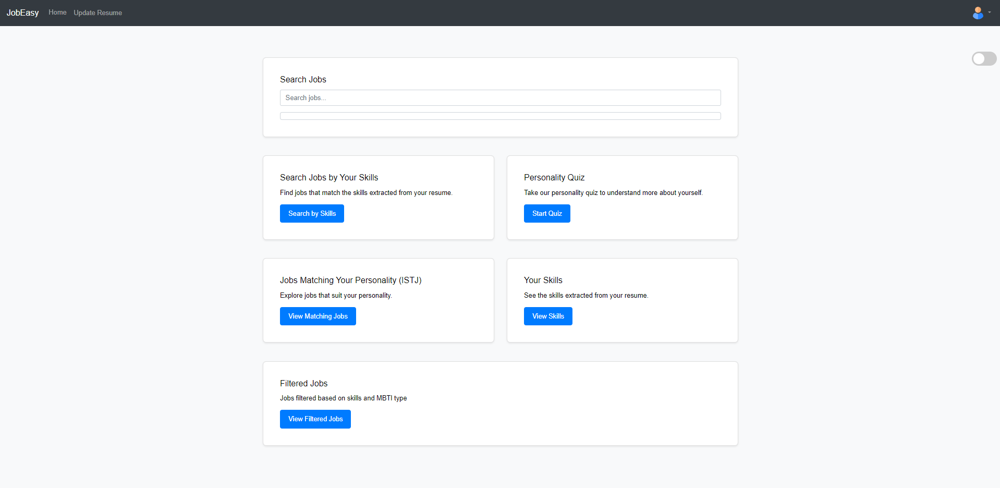
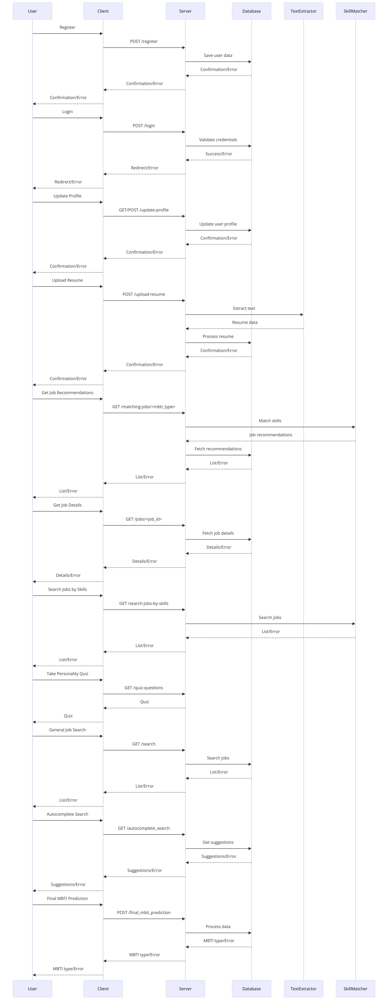

# Job Easy

Job Easy is a web application designed to simplify the job search process. This application helps users find job listings, manage applications, and track their job search progress.

## Table of Contents

- [Key Features](#key-features)
- [Installation](#installation)
- [Usage](#usage)
- [Homepage](#homepage)
- [Project Structure](#project-structure)
- [ML Models](#ml-models)
- [Diagram](#diagram)
- [Contributing](#contributing)


## Key Features

- **User Registration and Login**: Secure user authentication allowing users to register, log in, and manage their accounts.
- **Personality Assessment Quiz**: Users can take a personality quiz to help tailor job recommendations.
- **Resume Upload**: Users can upload their resumes in PDF or DOCX.
- **Personality Prediction**: Utilizes machine learning models to predict users' MBTI personality type based on quiz answers and essay answers analysis.
- **Personalized Job Matching**: Aligns job recommendations with users' personality and skills for a better job fit.
- **Browse Job Listings**: Users can browse a wide range of job listings that are matched to their profiles.
- **Apply for Jobs**: Easy application process for jobs directly through the platform.
- **Manage Job Search Progress**: Dashboard for users to manage their job search activities, view recommended jobs, and monitor application statuses.
- **Job Recommendations**: Provides personalized job recommendations based on users' MBTI type and extracted skills.
- **Search Jobs by Skills**: Allows users to search for jobs based on specific skills listed in their profiles.
- **Detailed Job Descriptions**: Provides comprehensive job descriptions and application instructions.
- **Data Security**: Ensures user data is securely stored and processed, adhering to best practices in data privacy and security.

## Installation

### Prerequisites

- Python 3.x
- Django
- MySQL

### Steps

1. Clone the repository:
    ```bash
    git clone https://github.com/sai-harsha-k/Job-Easy.git
    cd Job-Easy/jobeasy
    ```

2. Create a virtual environment and activate it:
    ```bash
    python3 -m venv venv
    source venv/bin/activate
    ```

3. Install the required packages:
    ```bash
    pip install -r requirements.txt
    ```

4. Configure MySQL settings in `jobeasy/settings.py`.

5. Apply migrations:
    ```bash
    python manage.py migrate
    ```

6. Run the development server:
    ```bash
    python manage.py runserver
    ```

## Usage

Once the server is running, open your web browser and navigate to `http://127.0.0.1:8000` to access the Job Easy application.

## Homepage



## Project Structure

- `core/`: Contains the core Django application files including models, views, and URLs.
  - `models.py`: Defines the database models including user profiles and job details.
  - `views.py`: Contains the logic for handling user requests and responses.
  - `urls.py`: Maps URLs to corresponding views.
  - `admin.py`: Configures the Django admin interface.
- `jobeasy/`: Contains the main application logic and configurations.
  - `settings.py`: Django settings configuration file, including MySQL database settings.
  - `urls.py`: Root URL configuration for the Django project.
  - `wsgi.py`: Web Server Gateway Interface configuration for deploying the project.
  - `asgi.py`: Asynchronous Server Gateway Interface configuration for deploying the project.
- `manage.py`: Django's command-line utility for administrative tasks.
- `staticfiles/`: Directory for static files (e.g., CSS, JavaScript, images).
- `templates/`: Directory for HTML templates used in rendering web pages.
  - `index.html`: Main page template.
  - `dashboard.html`: User dashboard template.
  - `job_recommendations.html`: Template for displaying job recommendations.
- `media/`: Directory for uploaded files such as user resumes.
- `ml_models/`: Directory containing serialized machine learning models and vectorizers.
  - `vectorizer_I-E.pkl`: TF-IDF vectorizer for I-E dimension.
  - `vectorizer_N-S.pkl`: TF-IDF vectorizer for N-S dimension.
  - `vectorizer_T-F.pkl`: TF-IDF vectorizer for T-F dimension.
  - `vectorizer_J-P.pkl`: TF-IDF vectorizer for J-P dimension.
  - `I-E_LogisticRegression.pkl`: Serialized Logistic Regression model for I-E dimension.
  - `N-S_CatBoost.pkl`: Serialized CatBoost model for N-S dimension.
  - `T-F_SVM.pkl`: Serialized SVM model for T-F dimension.
  - `J-P_XGBoost.pkl`: Serialized XGBoost model for J-P dimension.
- `scripts/`: Directory for utility scripts and data preprocessing.
  - `preprocess.py`: Script for preprocessing text data.
  - `train_models.py`: Script for training and saving machine learning models.
  - `evaluate_models.py`: Script for evaluating models and generating ROC and precision-recall curves.
- `data/`: Directory for storing datasets used in the project.
  - `mbti_1.csv`: This dataset includes MBTI types and corresponding text posts. It serves as a reference for running analyses or building preliminary models. However, the actual dataset used to develop our models cannot be shared due to a non-disclosure agreement with the dataset owner.
  - `skills.csv`: Dataset containing a list of skills.

## ML Models

We have a comprehensive notebook detailing the implementation of our MBTI prediction model. This notebook includes the data preprocessing steps, model training, evaluation, and saving the trained models. You can find the notebook here: [MBTI Model Notebook](https://github.com/sai-harsha-k/Job-Easy/blob/main/jobeasy/core/ml_models/MBTI_model%20(2).ipynb)

The notebook contains:
- Data preprocessing steps including cleaning, tokenization, and TF-IDF vectorization.
- Training of the CatBoost and SVM models for predicting MBTI dimensions.
- Evaluation metrics to assess the performance of the models.
- Steps to save and load the trained models for future predictions.

## Diagram



## Contributing

We welcome contributions! Please follow these steps:

1. Fork the repository.
2. Create a new branch (`git checkout -b feature-branch`).
3. Make your changes and commit them (`git commit -m 'Add new feature'`).
4. Push to the branch (`git push origin feature-branch`).
5. Create a pull request.
